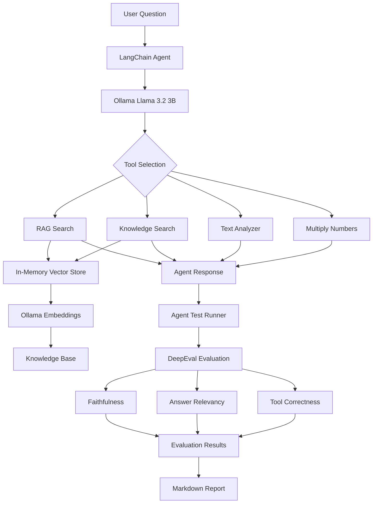

# Agentic AI Evaluation System — Architecture

```mermaid
flowchart TD
    A[User Question] --> B[LangChain Agent]

    B --> C[Ollama Llama 3.2 3B]

    C --> D{Tool Selection}

    D --> E[Multiply Numbers]
    D --> F[Text Analyzer]
    D --> G[Knowledge Search]
    D --> H[RAG Search]

    G --> I[In-Memory Vector Store]
    H --> I

    I --> J[Ollama Embeddings]
    J --> K[Knowledge Base]

    E --> L[Agent Response]
    F --> L
    G --> L
    H --> L

    L --> M[Agent Test Runner]
    M --> N[DeepEval Evaluation]

    N --> O[Tool Correctness]
    N --> P[Answer Relevancy]
    N --> Q[Faithfulness]

    O --> R[Evaluation Results]
    P --> R
    Q --> R

    R --> S[Markdown Report]
```